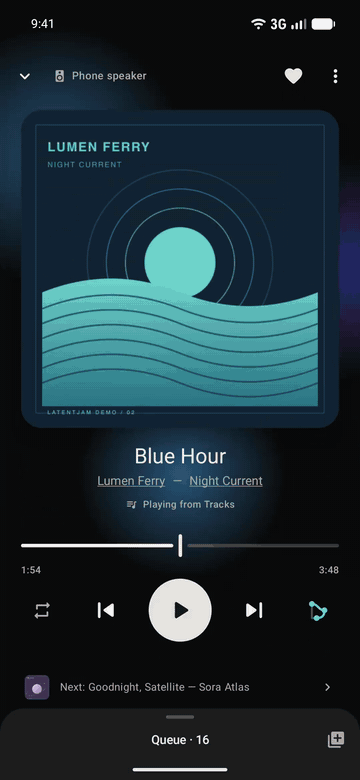
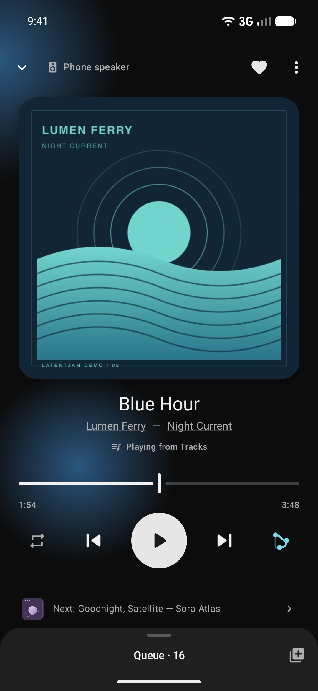
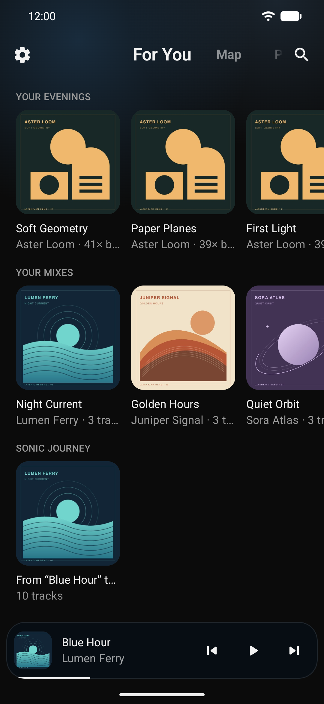
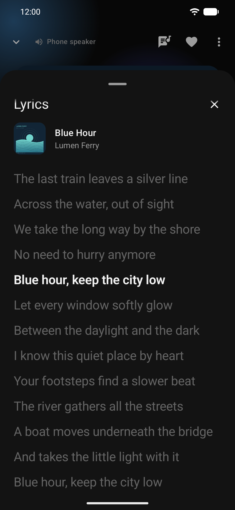
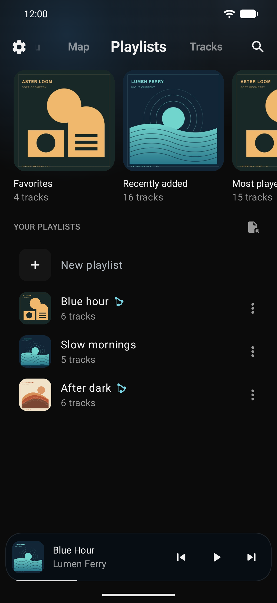

<p align="center">
  
</p>

<h1 align="center">LatentJam</h1>

<p align="center">
  <b>A music player that knows what your library <i>sounds</i> like.</b><br>
  Free and offline, for the songs already on your phone: no account, no streaming, no network.
</p>

<p align="center">
  <a href="https://github.com/Nikita-sud/latentjam/releases/latest"></a>
  <a href="https://f-droid.org/packages/io.github.nikitasud.latentjam.kmp/"></a>
  <a href="https://github.com/Nikita-sud/latentjam/releases"></a>
  <a href="https://github.com/Nikita-sud/latentjam/stargazers"></a>
  
  <a href="LICENSE"></a>
  
</p>

<p align="center">
  <b><a href="https://github.com/Nikita-sud/latentjam/releases/latest">Android APK</a></b> ·
  <b><a href="https://f-droid.org/packages/io.github.nikitasud.latentjam.kmp/">F-Droid</a></b> ·
  <b><a href="#install">iPhone (sideload, not on the App Store)</a></b><br>
  <sub>No account · no analytics · no ads · no internet permission on Android · <a href="PRIVACY.md">Privacy</a> · <a href="#install">Install guide</a></sub>
</p>

---

Shuffle on a local player is a dice roll. Pick a song in LatentJam and **SMART**, its shuffle, queues
up others from your own library that sound like they belong next to it. **For You** brings back the
records you own and forgot. Edit your tags, follow synced lyrics, see your library as a map. The
models that listen to your music run on the phone itself, so nothing about your listening ever
leaves it.

<p align="center">
  
</p>

<p align="center"><a href="docs/media/player-demo.mp4">Player & lyrics · 25 seconds</a> · <a href="docs/media/walkthrough.mp4">Explore the app · 46 seconds</a></p>

<p align="center">
  &nbsp;&nbsp;
  &nbsp;&nbsp;
  &nbsp;&nbsp;
  
</p>

<p align="center"><sub>Android screens from version 0.5 (tag editing and other newer features aren't pictured) with a fictional demo library: invented artists, original artwork and timed demo lyrics. More screens, both themes and the library map are in <a href="docs/media/README.md">docs/media</a>.</sub></p>

## Install

> **Beta, pre-1.0.** Screens and settings can still change between releases. Tag editing writes to
> your real files, so back up the music you care about before a big edit. SMART gets noticeably
> better once the first background analysis has finished. Found a bug?
> [Open an issue](https://github.com/Nikita-sud/latentjam/issues).

**Which one?** On Android, take the arm64 APK: it is always the newest version and the smaller
download. Use F-Droid if you already do (it updates the app for you), but it can be a release
behind, so the newest features may not have arrived there yet. On iPhone, sideload the IPA.

- **Android APK** — from the [Releases page](https://github.com/Nikita-sud/latentjam/releases/latest),
  download `LatentJam-vX.Y.Z-arm64.apk` (about 38 MB; fits almost any phone from the last decade).
  Old 32-bit phones need the `armv7` APK (about 46 MB). Open it on the phone, allow installing
  unknown apps and tap through Play Protect's warning. Requires **Android 7.0+**.
- **[F-Droid](https://f-droid.org/packages/io.github.nikitasud.latentjam.kmp/)** builds LatentJam
  from this source on its own schedule, so it can trail the newest release here; it ships one larger
  APK for every processor type (66 MiB).
- **iPhone IPA** — not on the App Store or TestFlight. The IPA (about 44 MB) is **unsigned**: install
  it with AltStore or Sideloadly from a Mac or PC, which re-sign it with your Apple ID; with a free
  Apple ID the install must be refreshed every 7 days. Requires **iOS 15.1+**. Music comes from files
  you import through the Files app and from songs downloaded to your Music library. Protected Apple
  Music downloads play and are searchable but can't be analysed by sound, so SMART, the map and the
  mixes work best with imported files or DRM-free purchases.

**Where your music comes from on Android:** LatentJam plays what Android's own media index knows
about; there is no manual "add folder" yet. If songs are missing, try Settings → Library → Refresh
library, and look for a hidden `.nomedia` file in the folder, which tells Android to skip it.
Settings → Library → Music sources picks which folders appear.

**Updating:** F-Droid updates the app for you. Otherwise install the new APK over the old one (your
library, history and settings stay), or sideload the new IPA. The app never goes online, so it can't
announce new versions: watch this repository for releases (Watch → Custom → Releases).

<details>
<summary>Switching between F-Droid and the GitHub APKs</summary>

They are signed with different keys and can't update each other. Export your data (Settings → Local
backup), uninstall, install the other one, then restore. The backup keeps playlists, history,
settings, hidden tracks and the tracks or artists you told SMART not to recommend; the song analysis
isn't included and runs again after the switch.

</details>

**First launch:** LatentJam asks for access to your music (notifications are optional, for analysis
progress; saving edited tags asks for permission to change those files; see [PRIVACY.md](PRIVACY.md)).
It then analyses your songs on the phone and shows a progress count; you can play music meanwhile.
SMART improves as more of the library is done and never falls back to a random shuffle. On iPhone,
analysis runs only while the app is open (plus a short grace period after you leave it), so leave it open
a while at first.

## Features

- 🎧 **SMART shuffle** — tap the shuffle button until it shows SMART, then pick any song. The queue
  that follows stays close to that song's sound and mood and moves gently from track to track. Start
  from an obscure record and you stay in that corner of your library instead of sliding toward your
  most-played songs. It notices what you skip during a session; any track or artist can be marked
  *Don't recommend* (Settings lists your exclusions), and a playlist can be *kept together in SMART*.
- ✨ **For You** — rediscovery, not discovery: you already own everything here. One confident pick,
  then rows such as songs you left unfinished, favourites gone quiet, what you play at this time of
  day, **mixes** of your library grouped by sound and a **sonic journey** from one track to a distant
  one. A never-played pick you pass over rests for a few days.
- 🏷️ **Tags read properly** — albums sort by their original release year (a 2011 remaster of a 1973
  album reads 1973), names garbled by a wrong charset ("Grüße") show as "Grüße" again without
  retagging, and every genre and credited artist of a track is kept.
- ✏️ **Edit your tags** — one song, a whole album, an artist or any selection, in MP3, FLAC, M4A,
  Ogg and Opus: title, artists, album, album artist, genre, year, track and disc numbers (with
  totals), lyrics and cover. The audio is never touched, and a save cut off by a crash or a full
  disk ends as the original file or the edited one, never a mix. On iOS, songs you imported can be
  edited; Music-library songs are read-only.
- 🎤 **Lyrics** — embedded in MP3, FLAC, M4A, Ogg and Opus files, or from a `.lrc` file named like
  the song (on Android, allow its folder under Settings → Library; on iOS, put it beside the song in
  LatentJam's Imported folder). Timed lyrics follow the song, and a tap on a line seeks there.
- 🔎 **Search that ranks like you expect** — titles first, then artist, album, genre, lyrics and
  finally what the words mean, so a query in one language can still find tags in another. Word order
  doesn't matter (`eminem mockingbird`), years and decades narrow results (`80s`), and фонк finds
  *phonk*, all on the phone.
- 🗺️ **A map of your library** — songs that sound alike sit together, so your genres appear as
  islands you can tap through, and any track can show where it lives. Add it as a page under
  Settings → Pages.
- 🎚️ **A real player underneath**
  - The player slides up over your library; the cover flips to show the track's details, and the
    seek bar previews the lyric line as you scrub.
  - An editable queue that survives restarts; playlists with M3U import/export and drag-to-reorder;
    album, artist, genre and folder browsing.
  - Fades on pause, optional smooth transitions (a fade of up to 12 s at each track boundary),
    volume normalisation, an equaliser, a sleep timer.
  - A duplicate finder that recognises the same recording saved twice even when the tags differ,
    and tells you which copy to keep.
  - Local backup and restore.
- ⚙️ **Make it yours** — in **Settings → Pages**, show, hide and reorder pages, pick the one to open
  on, and add the **Statistics** dashboard (listening time, habits, first listens, top tracks and
  artists; also under Settings → Statistics).
- 📱 **On Android** — three home-screen widgets that wear the playing track's colour, a Quick
  Settings tile, Android Auto, and headphone or system media buttons that pick the last queue back
  up without opening the app.
- 🌍 **18 languages** — including Russian, Romanian, Arabic and Hebrew (right-to-left), Chinese,
  Japanese and Korean, with correct plural forms.

iOS has everything above except the Android extras, smooth transitions and volume normalisation
(see [the platform table](#one-engine-two-platforms)).

## How SMART works

Every track is described by its sound, its tags and what is known about its artist. SMART picks the
next song by asking a small model which candidate fits what you have just played. All of it is
computed on the device:

| Signal | Dimensions | Where it comes from |
|---|---:|---|
| **Audio embedding** | 960 | A pruned MobileNetV4-Conv-M encoder over the raw waveform, its 4-bit weights run by LatentJam's own ONNX Runtime operator |
| **Metadata embedding** | 384 | A 4 MB text encoder trained to reproduce MiniLM's sentence vectors (with search phrases in twenty languages), over trusted `genre; artist; original year; language` tags |
| **Artist knowledge** | 384 | What an offline teacher wrote about the 350k MusicBrainz and Wikidata artists the name index knows (its 190k confident answers are kept, about 20 bytes each); a small adapter guesses it for the rest |

**Retrieval.** Three rankings are interleaved into one 100-track candidate pool: audio close to the
track you picked, audio close to the session, and what is known about the seed's artist (from the
knowledge pack, or guessed from its tags by the adapter when the pack doesn't know them), falling
back to the seed's tag text when neither exists. No hand-tuned weight sits between them. Songs from
a playlist you marked *Keep together in SMART* are added if retrieval missed them.

**Scoring.** A 960-d GRU state encoder reads your last four plays, completion and skip signals,
long-term taste (centroids with 30- and 365-day half-lives) and the time of day and week, and feeds
a frozen scorer over the pool. The scorer sees each candidate's audio embedding next to its metadata
vector, with the session's metadata centroid on the state side. It was trained with text dropout, so
a track without usable tags is scored on audio alone.

**The queue.** A scoring chain balances the model's vote against local coherence, keeps pulling back
toward the track you chose, and uses pool-relative semantic scores so niche corners of a library
stay intact. On top sits a small correction learned from a blind judge's rankings of real playlists
(public MPD data): it passes over a candidate that would change the sound abruptly while a closer one
is left, and the walk carries on across top-ups. Metadata rules nudge repeated artists down instead
of banning them (each further song by one artist in a row must fit better by more; Settings → SMART
engine → Artist variety), suppress duplicate titles, other versions of a song included, and keep one
very dense cluster (cinematic and anime soundtracks) from crowding the queue. Playlists marked *Keep
together in SMART* earn points, not reserved slots. The finished queue is ordered into gentle
transitions.

**Messy tags.** Track *titles* are excluded from the embedding, so a filename like `Hard Techno Mix`
can't inject a genre claim. The language word comes from the file's tag, then from the language the
artist pack says they sing in, then from the script of the title, never from its words. A track with
no year carries its artist's decade.

**Tuning.** The scorer's weights are frozen and *objective*: SMART ranks by what the music is, not by
who is listening. Listening history is used as runtime context, **never trained on and never
uploaded**. The constants around the scorer (chain weights, the learned correction, spacing) are
chosen by replaying recorded model outputs and simulated listeners through the full chain and by blind
judges on public playlists, not by hand.

**Cold start.** The audio index builds in small persisted batches spread over the whole library;
until candidates are ready, SMART *abstains* rather than quietly falling back to random. A listener
with no history gets a state trained for exactly that case, so the first queue is still meaningful.

**What ships.** Five ONNX graphs ship in-tree: the audio encoder runs once per track while indexing;
the metadata encoder runs at indexing and for search queries; the state encoder and the scorer run
while a queue is built; a small semantic head turns audio embeddings into the genre-family scores the
map and the mixes use. The model bundle (graphs, vocabulary, the artist index and the knowledge pack)
is about 24 MB on both Android and iOS. There is no precomputed per-track catalogue: an imported
track takes exactly the same local path as everything else.

**Further reading:** [docs/model-selection.md](docs/model-selection.md) (architecture choice,
benchmarks, rejected candidates) and [docs/for-you-ux.md](docs/for-you-ux.md) (the research behind
For You).

## One engine, two platforms

The intelligence, SMART included, lives in shared Kotlin; each platform supplies only the native
seams.

| | Android | iOS |
|---|:---:|:---:|
| On-device ONNX inference | ORT (JNI) | ORT (native C API, Swift host) |
| Audio decode for indexing | MediaCodec | AVAudioFile / AVAudioConverter |
| Library source | MediaStore | Files import · Music library |
| Playback | Media3 (ExoPlayer) | AVAudioEngine (imported files) · MPMusicPlayerController (Music library) |
| Tag editing (MP3 · FLAC · M4A · Ogg · Opus) | ✓ | ✓ (imported files; Music library is read-only) |
| Equaliser | system effect | own AVAudioEngine graph (imported files) |
| Smooth transitions · volume normalisation | ✓ | — not yet |
| Widgets · QS tile · Android Auto | ✓ | n/a |

## Building

```bash
# Android (debug)
./gradlew :androidApp:assembleDebug

# Android (release: R8-minified, per-ABI splits under androidApp/build/outputs/apk/release/)
./gradlew :androidApp:assembleRelease

# iOS (from the Xcode workspace, after one pod install)
cd iosApp && pod install
xcodebuild -workspace iosApp.xcworkspace -scheme iosApp -sdk iphonesimulator build
```

- **JDK 17+** and the Android SDK; the first build pulls a large Kotlin/Native toolchain. Xcode's
  Gradle phase looks for the JDK on `PATH` plus `/opt/homebrew/opt/openjdk@21/bin`.
- **16 GB of RAM**: Gradle and Kotlin/Native get 8 GiB heaps.
- The Gradle daemon is disabled in `gradle.properties`, so every run starts cold.
- iOS brings ONNX Runtime in through CocoaPods (`onnxruntime-c`) and reaches it from Kotlin through
  the Swift host.

The published arm64 APK swaps in a reduced ONNX Runtime (identical results, smaller download); see
[tools/runtime/README.md](tools/runtime/README.md). Without it the build uses the stock runtime.

## Project layout

```
core/smart      similarity engine, SMART chain, ONNX runtimes, tokenizer, MusicBrainz index
core/library    library scanning, tag reading + crash-safe writing (FLAC/Ogg/MP4/ID3),
                lyrics (embedded + .lrc), playlists, catalogue grouping
core/playback   Media3 / AVAudioEngine playback, queue, equaliser
core/history    listening events, aggregates, For You impressions
composeApp      all UI, shared verbatim by both platforms
androidApp      packaging shell (see below)
iosApp          Xcode project + thin Swift host
build-logic     the build's own Gradle plugin: the Kotlin/Native name check
docs            design notes and validation records
fastlane        store listing and per-release changelogs (read by F-Droid)
branding        logo
tools           one-off scripts, research harnesses and the opt-in reduced ONNX Runtime build
```

`androidApp` holds no Kotlin on purpose. AGP 9 won't combine `com.android.application` with the
Kotlin Multiplatform plugin or with `kotlin-android`, so all code, `MainActivity` included, lives in
`composeApp` (an Android library) and `androidApp` only packages it.

## Contributing

Issues and pull requests are welcome; please run the host tests before opening a PR:

```bash
./gradlew testAndroidHostTest
```

They first run `checkNativeIdentifiers`, which catches test names Kotlin/Native rejects but the JVM
accepts (its own tests: `./gradlew :build-logic:test`).

<details>
<summary>Optional checks with fixtures</summary>

Each skips unless its fixture is present, so the default run stays fast and offline.

- **SMART parity** replays the reference implementation's own recorded model outputs through this
  port and asserts the resulting queues match *exactly*. Point `SMART_PARITY_FIXTURE` at a fixture
  made by `tools/export_parity_fixture.py --scorer semtext1344` (generating one needs the
  maintainer's offline data).
- **Chain and For You simulations** replay recorded outputs and synthetic listeners through the full
  chain; they are how the recommender's constants are chosen and defended. They need
  `SMART_PARITY_FIXTURE` and `SMART_SIM_INPUT`.
- **Real files** check codecs against actual music, because synthetic fixtures only prove a codec
  matches one reading of the spec. Point `TAG_REAL_FILES` at a folder of mixed files (every codec,
  read and edit, never modified) and `TAG_REAL_FILES_OUT` at a scratch folder (adds the crash-safe
  write; copies land there), `ID3_REAL_FILES` at `.mp3`s (ID3 reader) and `REAL_AUDIO_FILE` at one
  track (embedded lyrics).

Gradle doesn't track these variables, so add `--rerun` to the test task, e.g.
`TAG_REAL_FILES=~/Music TAG_REAL_FILES_OUT=/tmp/lj-tags ./gradlew :core:library:testAndroidHostTest --rerun`.

</details>

## Credits

LatentJam builds on:

- **[ONNX Runtime](https://onnxruntime.ai/)** — on-device inference on both platforms
- **[MobileNetV4](https://arxiv.org/abs/2404.10518)** — the audio encoder's architecture
- **[EfficientAT](https://github.com/fschmid56/EfficientAT)** — the audio teacher, and part of the genre head's weights (MIT)
- **[MiniLM](https://arxiv.org/abs/2002.10957)** — the teacher behind the text embeddings and the knowledge pack
- **[MusicBrainz](https://musicbrainz.org/)** and **[Wikidata](https://www.wikidata.org/)** — the CC0 artist data behind smart search and the knowledge pack
- **[DeepSeek](https://www.deepseek.com/)** — the offline teacher whose artist descriptions the knowledge pack distills
- **[Compose Multiplatform](https://www.jetbrains.com/compose-multiplatform/)**, **[Koin](https://insert-koin.io/)**, **[Coil](https://coil-kt.github.io/coil/)**, **[Media3](https://developer.android.com/media/media3)**

## Licence

**Apache-2.0** — see [LICENSE](LICENSE) and [NOTICE](NOTICE).

Bundled models under `androidApp/src/main/assets/ml/` (mirrored in `iosApp/iosApp/ml/`) are covered
by permissive licences documented in [LICENSE-MODEL.txt](androidApp/src/main/assets/ml/LICENSE-MODEL.txt).

<p align="center"><sub>Everything runs on your device. Your taste stays there.</sub></p>
