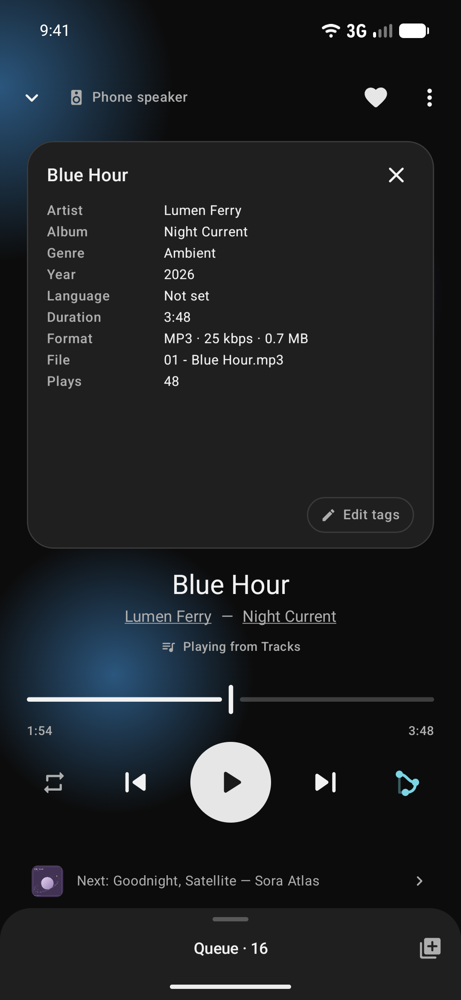
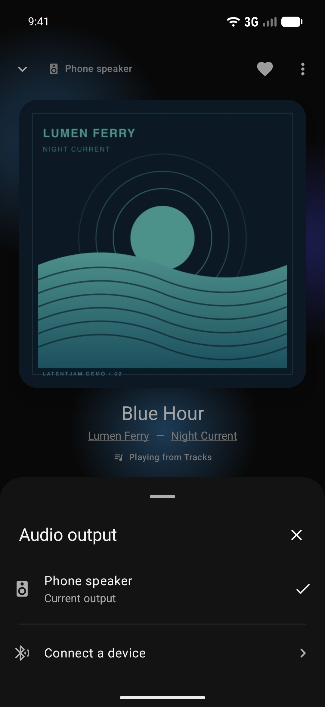
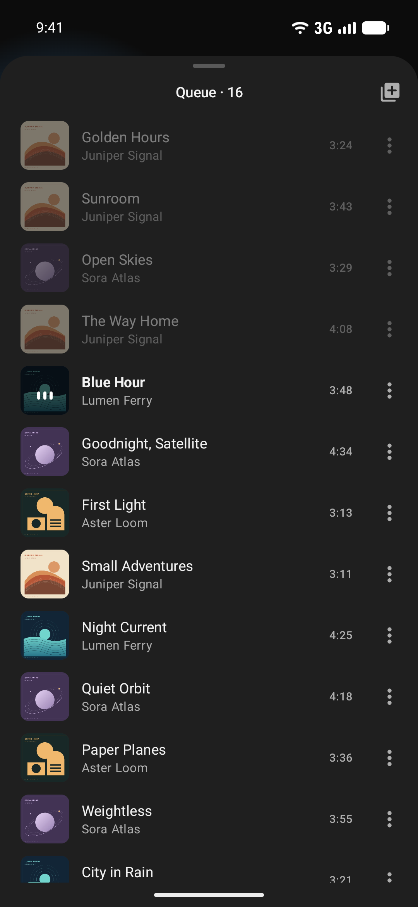

# LatentJam 0.4.0 demo media

The player videos and seven screenshots below were recorded on **20 September 2026** in the
actual Android **0.4.0 release build (versionCode 6)**, using a separate, newly created emulator.
The demo contains sixteen invented tracks by four fictional artists, original geometric cover art,
quiet synthesized audio, and generated listening history and playlists. No personal library or
existing emulator data was imported.

| Asset | Details |
| --- | --- |
| [player-demo.mp4](player-demo.mp4) | 24-second player demo for sharing, 1080 × 2340, 30 fps, about 2.3 MiB |
| [walkthrough.mp4](walkthrough.mp4) | 40-second app walkthrough, 720 × 1560, 30 fps, about 2.0 MiB |
| [walkthrough.gif](walkthrough.gif) | 24-second player loop for the README, 360 × 780, 10 fps, about 3.6 MiB |
| [player.png](player.png) | “Blue Hour” in the redesigned SMART player |
| [player-details.png](player-details.png) | Track facts on the back of the cover, with the compact Edit tags button |
| [audio-output.png](audio-output.png) | Compact audio output sheet |
| [queue.png](queue.png) | Expanded queue with its title below the status bar |
| [for-you.png](for-you.png) | Discovery and recommendations |
| [statistics.png](statistics.png) | Synthetic thirty-day listening summary and daily activity |
| [pages.png](pages.png) | Visibility, ordering, and opening-page controls |

The seven PNGs are unmodified 1080 × 2340 screenshots. Both videos are silent H.264 with fast-start
playback and no source metadata. Gestures run at their recorded speed, including in the GIF; the
full walkthrough holds its final screen for two extra seconds. The player clip and GIF are continuous
excerpts of the same recording.

The player demo shows playback, the cover flipping to track facts, swiping between covers, seeking,
the audio output sheet, and expanding and collapsing the queue. The full walkthrough also shows
For You, Albums, Statistics, and Pages. Map remains disabled; Statistics is explicitly enabled.

<p align="center">
  &nbsp;&nbsp;
  &nbsp;&nbsp;
  
</p>

[map.png](map.png) is an older capture, retained for the Map validation document. It was recorded
on **14 September 2026**, in Russian, in a separate empty emulator with the same fictional library.
It is not part of the 0.4.0 capture set.

## Recreate the demo data

Use Python 3.9+ with Pillow, `ffmpeg` with `libmp3lame`, and `rsvg-convert`:

```sh
python3 tools/readme/generate_demo_library.py --output-dir /tmp/latentjam-readme-demo
```

This creates MP3s with embedded cover art, editable SVG covers, and a manifest outside the repository.
Install the current debug APK in a **separate empty emulator**, copy only the generated `Music`
directory to its music storage, and scan those files into MediaStore.

Query the demo emulator's complete music library with the projection
`_id:title:artist:album:duration` and selection `is_music != 0`, saving the result as
`/tmp/readme-media-query.txt`. Generate the matching app-file payloads:

```sh
python3 tools/readme/seed_demo_history.py \
  --metadata /tmp/latentjam-readme-demo/manifest.json \
  --media-query /tmp/readme-media-query.txt \
  --out /tmp/readme-seed --timezone UTC
```

The generator refuses libraries that do not exactly match the fictional title/artist allowlist.
It only creates local payload files. Copy its `files` and `shared_prefs` payloads into the dedicated
debug app with `run-as` while that app is stopped. Upgrade it in place to the matching release APK
signed with the same key, retaining the demo data, and verify its installed version before capture.
Do not apply the payloads to a real library.
The history uses the current time; `--now-ms` makes the data reproducible for a particular date.

For the captured presentation, use English, dark theme, 1080 × 2340 at 420 dpi, and the Android demo
status bar (09:41, full battery, hidden notifications). Wait for demo library indexing to finish.
Play “Blue Hour” from Tracks, pause it, enable SMART, seek to 1:54, and return to For You before recording.

## Export and review

Record the actual device screen at 1080 × 2340 to a temporary MP4. Keep a 1080 px player excerpt for
sharing and encode the full walkthrough at 720 px, both at 30 fps with silent, fast-start H.264.
For the README, encode the player excerpt as a 360 px, 10 fps GIF with a shared 96-color palette and
ordered dithering. Keep raw recordings, generated audio, and emulator images outside the repository.

Validation included full GIF/MP4 decode checks, PNG verification, local README link checks, and visual
inspection of every screenshot, video contact sheets, the final video frame, and cover transitions.
The complete MediaStore library matched the sixteen-track fictional manifest. The installed package
reported versionName 0.4.0 and versionCode 6. Selected stills contain no permission prompts or loading
screens. No application code was changed for these recordings.
