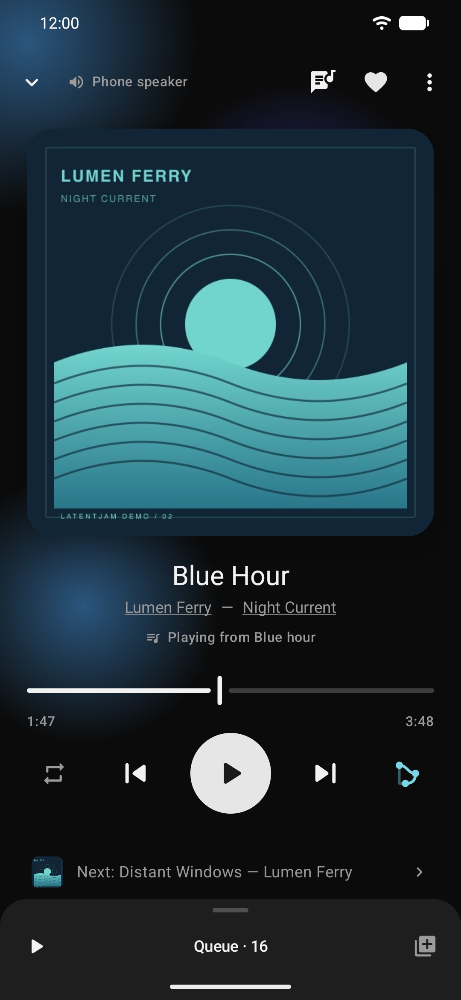
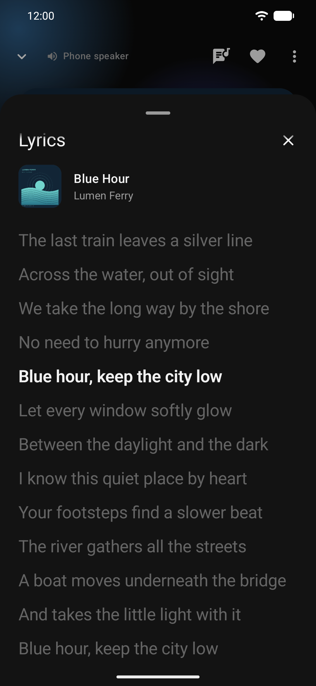
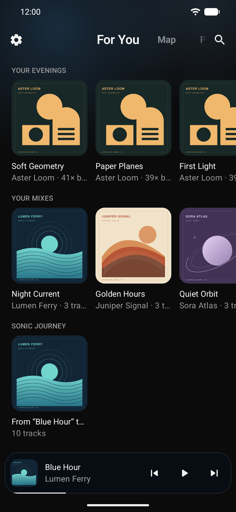
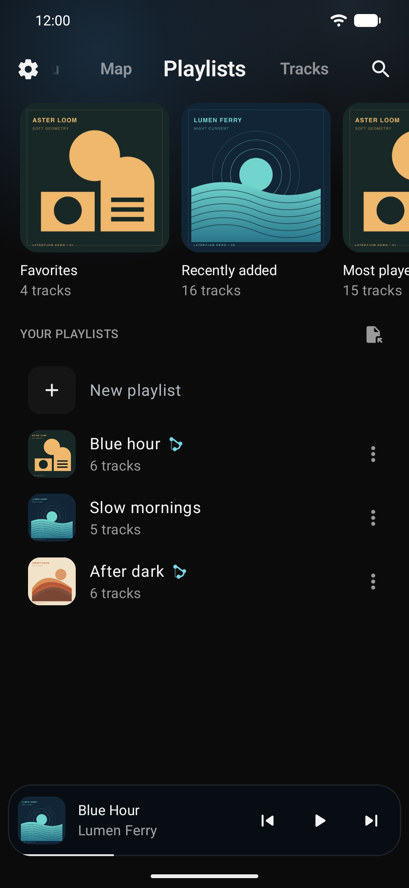
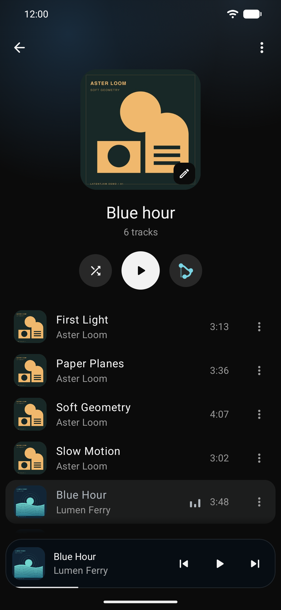
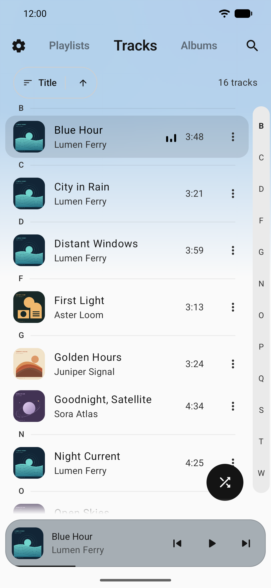
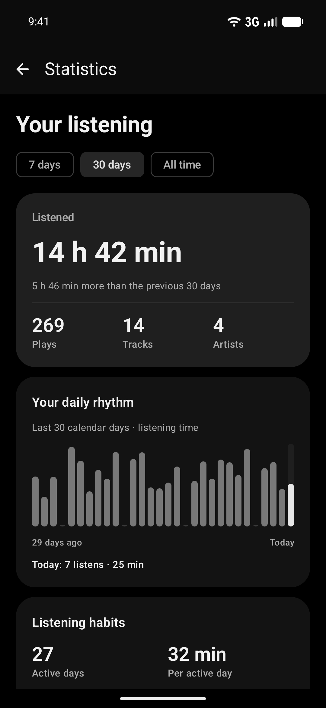
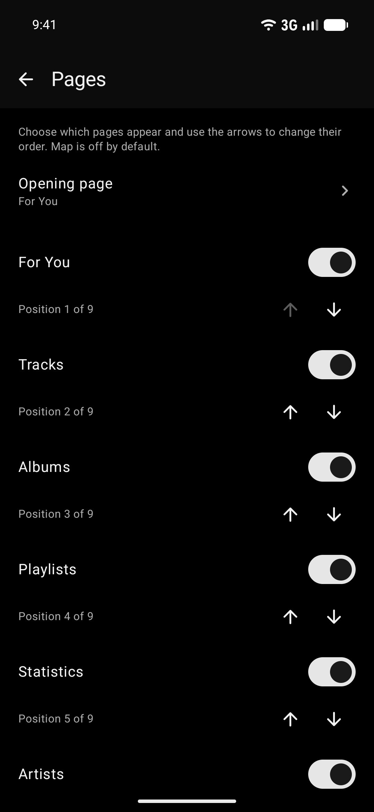
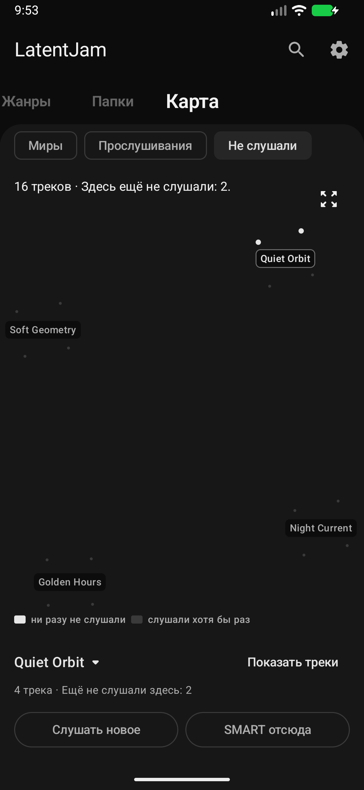
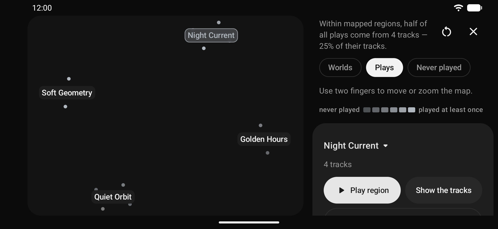

# LatentJam demo gallery

Screenshots captured on **23 September 2026** from the actual Android **0.5.1 build (versionCode 9)**,
compiled in release configuration and installed in the dedicated “LJ demo” emulator. The videos
were recorded the same day on the 0.5.0 build, whose screens are identical.
These are real app screens, not interface mockups.

The library contains sixteen fictional songs by four invented artists, original geometric
cover art, synthesized instrumental audio, and generated listening history and playlists.
Every song now contains original English timed lyrics. The audio has **no vocals**: these
texts and timestamps demonstrate lyric following, highlighting and tap-to-seek.
No personal music, third-party lyrics or downloaded artwork are included.

## In motion

- [Player and lyrics](player-demo.mp4) — 25 seconds, 1080 × 2340, 30 fps.
- [App walkthrough](walkthrough.mp4) — 46 seconds, 720 × 1560, 30 fps; discovery, playlists, playback, lyrics, track facts,
  the queue, light theme, map and statistics.
- [README preview](walkthrough.gif) — a 14-second, 360 × 780, 10 fps loop.

Both videos are silent H.264 with fast-start playback and stripped source metadata. They are
edited from real screen recordings at their original speed; idle time is cut. The walkthrough
also includes brief stills of actual screens. No UI animations or features are simulated.

## Player, lyrics and queue

<p align="center">
  &nbsp;
  &nbsp;
  
</p>

<p align="center">
  &nbsp;
  
</p>

## Your library

<p align="center">
  &nbsp;
  &nbsp;
  
</p>

<p align="center">
  &nbsp;
  &nbsp;
  
</p>

## Explore the map

<p align="center"></p>
<p align="center"></p>

Map and Statistics are enabled for this demo; they remain optional in the app.
The small synthetic library is useful for showing the controls. Its four regions are not a
benchmark of clustering quality on a real music collection.

## Recreate the demo data

Use Python 3.9+ with Pillow, `ffmpeg` with `libmp3lame`, and `rsvg-convert`:

```sh
python3 tools/readme/generate_demo_library.py --output-dir /tmp/latentjam-readme-demo
```

This writes MP3s with embedded artwork and standard ID3 **USLT** lyric frames, matching `.lrc`
files under `Lyrics/`, editable SVG covers and a manifest. The original lyric source is
[demo_lyrics.json](../../tools/readme/demo_lyrics.json). Each song has sixteen timed lines,
including a repeated chorus. Everything generated stays outside the repository.

Install the current debug APK in a **separate demo emulator**, copy the generated `Music`
directory to its music storage, and scan those files into MediaStore. Query the demo emulator's
complete music library with projection `_id:title:artist:album:duration` and selection
`is_music != 0`, saving the result as `/tmp/readme-media-query.txt`. Then generate app-file payloads:

```sh
python3 tools/readme/seed_demo_history.py \
  --metadata /tmp/latentjam-readme-demo/manifest.json \
  --media-query /tmp/readme-media-query.txt \
  --out /tmp/readme-seed --timezone UTC --show-map
```

The seeder refuses libraries that do not exactly match the fictional title/artist allowlist.
It creates local payload files only. With the demo app stopped, back up its data and copy the
`files` and `shared_prefs` payloads into that debug app using `run-as`. Upgrade it in place to the
matching release APK signed with the same key, retaining demo data. Do not seed a real library.
The history uses the current time; `--now-ms` makes a particular date reproducible.

Use English and Artwork player colors. Capture both themes through Settings → Appearance.
Wait for indexing before showing the map and recommendations. For the lyric example, play
“Blue Hour”, open Lyrics, expand the sheet, and tap a line to demonstrate seeking.

## Capture and validation

Screenshots were captured directly from the demo emulator with ADB, its display set to
1080 × 2340 at 420 dpi (the same 411 dp width as its native 1440 × 3120 at 560 dpi), and saved
as lossless RGB PNGs. Their UI content is unchanged. The Android status and navigation bars are
retained; SystemUI demo mode keeps the status bar to a fixed 12:00 clock, full Wi-Fi and battery,
and no notification icons.
Raw captures, generated audio and emulator backups stay outside the repository.

Validation covers all sixteen embedded lyric frames and matching LRC files: 256 timed lines,
strictly increasing timestamps within each song's duration. The application's own embedded-lyrics
reader also passed with the generated MP3, and following/seeking was checked in the actual player.
The release package reports version 0.5.1, code 9. Final media are checked by full decode,
image verification, local link checks, and visual inspection of stills and video contact sheets.

The store asset generator uses the same current English captures. Its separate export trims only
the status and navigation bars to 1080 × 2160. No store upload is performed by this workflow.
