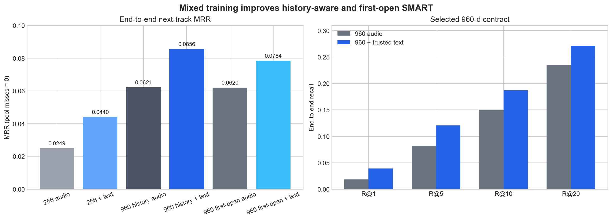
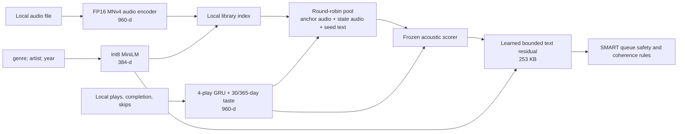

# LatentJam SMART model decision

Decision date: 2026-07-20
Scope: fully local Android and iOS inference; Apache-2.0 application; no private Mac-generated
descriptor catalogue

## Executive decision

Ship the 960-dimensional acoustic contract and a 253 KB optional-text residual trained jointly for
history-aware and first-open use. Do not promote the 256-dimensional stack yet.

The final session-grouped evaluation uses 1,519 real completed next-track examples from 145 sessions
and 860 usable tracks in the supplied database. Each transition is evaluated in two contexts and
kept in the same fold: observed local history, and the exact seed-only state seen by a person opening
the app for the first time. Relative to the frozen 960-d acoustic scorer, trusted text improves:

- history-aware MRR from **0.06215 to 0.08555 (+37.7%)**, R@10 from **14.94% to 18.70%**;
- first-open MRR from **0.06199 to 0.07837 (+26.4%)**, R@10 from **14.29% to 17.71%**.

Missing text is an exact audio-only fallback in both modes.

The 256-d experiment is useful research but fails the lossless promotion criterion. On its exact
phone pool, text raises end-to-end MRR from 0.02489 to 0.04401, but the frozen 960-d scorer reaches
0.06579 on those same candidates. The 256-d result is therefore 33.1% below the stronger scorer even
after text conditioning.

## Selected phone architecture

Five physical ONNX graphs are shipped:

| Graph | When it runs | Contract | Bytes |
|---|---|---:|---:|
| `mnv4_audio.onnx` | track indexing | 10 s, mono 32 kHz → 960 | 21,939,891 |
| `text_encoder_minilm.onnx` | metadata indexing | WordPiece tokens → 384 | 22,972,370 |
| `predictor_state.onnx` | each SMART hop | recent 960-d history → 960 | 11,917,220 |
| `predictor_scorer_n100.onnx` | each SMART hop | state + 100 audio candidates → 100 | 2,728,912 |
| `predictor_text_residual_n100_960.onnx` | each SMART hop | base logits + optional text → 100 | 253,566 |

The vocabulary adds 231,508 bytes. Total model/vocabulary size is **60,043,467 bytes (57.3 MiB)** on
each platform. There are four execution stages from the app's perspective: audio indexing, text
indexing, session-state encoding, and candidate scoring; the last stage is deliberately split into a
frozen acoustic graph and a replaceable text residual.

All inputs, events, embeddings, and scores remain on the phone. First launch progressively creates
and persists the audio index in eight-track batches; the selected seed is embedded on demand if its
batch has not arrived yet. Playback never waits for the whole library and uses a metadata-only fallback
until enough local candidates exist. The RunPod was used only for offline training and evaluation.

## Is MNv4 the final encoder architecture?

No. MNv4 is the **best verified shipping encoder in this study**, not proof of the best possible
waveform model for LatentJam. The app-specific architecture in this release is the system around the
encoder: multi-channel retrieval, the short/medium/long listening state, the acoustic scorer, the
optional-text residual, and the slate rules. The 256-d work trained a new state model and scorer over
a compressed audio space; it did not train a new waveform-to-embedding trunk end to end. Its failure
rejects PCA-style 256-d replacement, not the idea of a native 256-d audio encoder.

The next encoder experiment should be a purpose-built `LJ-Audio-S` student with this contract:

- one local 10-second, mono 32 kHz clip at inference, with crop, gain, codec, EQ, noise and channel
  augmentation during training;
- an ONNX-friendly 128-bin log-mel front end and four small Universal Inverted Bottleneck stages,
  followed by at most two mobile multi-query-attention blocks on the coarsest time grid;
- a factorized 384-d output: 256 learned content dimensions, 64 rhythm dimensions and 64
  pitch/harmonic dimensions. Also train a native 256-d head from the same trunk; do not obtain it by
  PCA after training;
- relational distillation that preserves teacher neighbourhoods, not only per-track cosine;
- a direct pool-aware next-track contrastive loss using the app's hard negatives and exact candidate
  builder, jointly evaluated in observed-history and seed-only first-open contexts;
- confidence-masked auxiliary targets from EfficientAT/MN10, Beat This, Basic Pitch and Whisper.
  Metadata/LLM labels may supervise training but are never required by the audio graph at runtime.

This shape is intentional. MobileNetV4's
[Universal Inverted Bottleneck and Mobile MQA](https://arxiv.org/abs/2404.10518) are designed for
efficiency across mobile CPUs and accelerators, while
[EfficientAT](https://arxiv.org/abs/2211.04772) demonstrates that a compact CNN can benefit from
offline transformer distillation in audio. LatentJam should retain those efficient building blocks
but change the objective from generic AudioSet tagging to the behaviour the product actually needs.
The rhythm and harmonic blocks can also become independent retrieval channels, improving candidate
coverage without adding another graph at queue time.

Train 256-, 384- and 512-d heads together, then select by the full phone pipeline. The 256-d head is
preferred only if it matches the shipped system's history-aware MRR 0.08555, first-open MRR 0.07837,
and approximately 53% pool recall under session-grouped evaluation, and remains stable on held-out
libraries. Otherwise ship 384-d; it reduces a 10,000-track FP32 index from about 36.6 MiB at 960-d
to 14.6 MiB while leaving room for explicit rhythm and harmony. Parameter count, ONNX bytes, cold
indexing time, peak memory, battery and thermal behaviour must be measured on physical low-, mid-
and high-tier Android devices and iPhones before replacing MNv4.

## Experimental design

The point-in-time database contains 862 track rows; 860 had usable paired data. It contains 3,960
listening events in 145 sessions. A positive example is a completed next-track event with at least
two preceding session plays, producing 1,519 examples. Training materializes both its observed-history
state and exact first-open state, for 3,038 context examples. Four validation folds are grouped by
session, so neither events nor the two contexts of one session can cross train/validation boundaries.

The selection metric is end-to-end reciprocal rank. A target that was not retrieved into the exact
100-candidate phone pool contributes zero. This matters: an earlier diagnostic force-inserted missed
targets and selected on conditional rank, which overstated the 256-d system. The final scripts build
the pool in the embedding space actually deployed and never optimize the synthetic insertion.

Text is not manually blended with audio. Candidate generation interleaves three separate rankings.
The residual learns whether and how much trusted text should move each frozen acoustic logit, subject
to a bounded ±0.75 correction and adversarial abstention losses.

## SMART-mode architecture research

The final design is deliberately a small hybrid, not a phone-sized imitation of a cloud recommender:

1. retrieve 100 candidates independently from current-track audio, learned session-state audio, and
   trusted seed metadata;
2. rerank them with the acoustic scorer plus the bounded optional-text residual;
3. build the slate sequentially with seed gravity, local coherence, energy smoothing, artist spacing,
   duplicate-title suppression, hub correction, and explicit abstention when neither model path has evidence.

This matches the established retrieval/ranking split described in the production
[YouTube recommender paper](https://research.google/pubs/deep-neural-networks-for-youtube-recommendations/).
The more recent [YouTube Music architecture](https://research.google/blog/transformers-in-music-recommendation/)
uses previous actions, the currently playing track, played percentage, time, metadata and track
embeddings to condition ranking, followed by filtering. Those are the same signal classes now
available locally in LatentJam. The difference is scale: YouTube can train attention over enormous
multi-user logs; this experiment has 1,519 positives from one listener.

The short-context GRU is the best present fit. [GRU4Rec](https://arxiv.org/abs/1511.06939) established
that modelling a whole short session can beat item-to-item recommendation. LatentJam combines that
four-play GRU with fixed 30- and 365-day reward/recency-weighted audio centroids; generated queue
picks update the short intent but do not rewrite the listener's long-term taste. This resembles the
short-realtime plus long-batch hybrid reported by
[TransAct](https://arxiv.org/abs/2306.00248), while remaining small and stateless enough for both
phone runtimes.

SASRec/BERT4Rec are research candidates, not the selected phone architecture. The
[SASRec paper](https://arxiv.org/abs/1808.09781) explicitly places parsimonious Markov-style methods
at an advantage in extremely sparse data and more complex recurrent/attention models at an advantage
as data becomes denser. [BERT4Rec](https://arxiv.org/abs/1904.06690) learns a bidirectional masked-item
objective, which is attractive after there are substantially more independent sessions, but is not
supported by this one-listener sample. [CL4SRec](https://arxiv.org/abs/2010.14395) is the most useful
next training experiment because it targets sparse sequential data through contrastive augmentation;
it should be tested only with semantic-preserving audio-neighbour substitutions and session-grouped
evaluation. SR-GNN is less suitable here: its item-transition graph is ID-centric, whereas new local
libraries need content-based cold start and have no population interaction graph.

Finally, queue quality is not only next-item accuracy. Amazon Music reported gains from relevance-aware
[submodular diversification](https://arxiv.org/abs/1810.01482). LatentJam's list-level rules are a
cheap deterministic approximation appropriate to current evidence. Learning a diversity weight or a
[Seq2Slate](https://research.google/pubs/seq2slate-re-ranking-and-slate-optimization-with-rnns/)
policy would require opt-in multi-listener outcomes; hand-tuning another opaque coefficient on the
single supplied library would not be justified.

The main measured bottleneck is retrieval: pool recall is only **53.1% history-aware** and **52.7%
first-open**. Therefore the next model experiment should improve multi-channel candidate recall or
distil a stronger retrieval teacher—not add a sixth runtime model or a larger reranker that never
sees nearly half of the targets.

## 256-dimensional result: reject for production

The component metrics looked strong:

| Component check | Result |
|---|---:|
| PCA variance retained | 98.92% |
| PCA top-10 neighbour overlap | 81.52% |
| Native 256 student genre P@10 | 0.6411 vs teacher 0.6346 |
| Native student target cosine | 0.9855 |
| Distilled state/teacher cosine | 0.9974 mean, 0.9773 minimum |
| Distilled scorer top-1 agreement | 80.87% |
| Distilled choice in teacher top-3 | 97.92% |

Those diagnostics did not predict the full pipeline. On the exact 256-d phone pool:

| Scorer on the same 256-d pool | End-to-end MRR | R@5 | R@10 | R@20 |
|---|---:|---:|---:|---:|
| 256 audio-only | 0.02489 | 2.04% | 5.46% | 10.99% |
| 256 + trusted text | 0.04401 | 5.33% | 9.74% | 16.72% |
| Frozen 960 scorer | **0.06579** | **8.76%** | **16.06%** | **24.69%** |

The result is a useful warning: high embedding cosine, neighbour overlap, and scorer imitation do not
guarantee next-track quality after candidate retrieval and ranking interact. A future 256-d model
needs end-to-end pool-aware fine-tuning or substantially more diverse session data; it should not be
shipped on the current evidence.

## Text conditioning and misleading metadata

The production text string is `genre; artist; year`. Titles are excluded by contract because
filenames and release titles routinely contain uploader tags, mix labels, and misleading genre
words.

| History-aware 960-d condition | End-to-end MRR | Top-1 agreement reference | Interpretation |
|---|---:|---:|---|
| Acoustic only | 0.06215 | 100% vs acoustic | baseline |
| Correct trusted text | **0.08555** | 44.11% vs acoustic | learned text changes useful decisions |
| Missing text | 0.06215 | **100% vs acoustic** | exact fallback; max logit delta 0 |
| Genre word injected into title | **0.08555** | **100% vs correct** | exact no-op because title is absent |
| Explicitly wrong genre field | 0.06539 | 89.40% vs acoustic | adversarial training mostly abstains |

| First-open 960-d condition | End-to-end MRR | Top-1 agreement reference | Interpretation |
|---|---:|---:|---|
| Acoustic only | 0.06199 | 100% vs acoustic | seed-only baseline |
| Correct trusted text | **0.07837** | 61.29% vs acoustic | useful without any personal history |
| Missing text | 0.06199 | **100% vs acoustic** | exact fallback; max logit delta 0 |
| Genre word injected into title | **0.07837** | **100% vs correct** | exact no-op because title is absent |
| Explicitly wrong genre field | 0.06091 | 88.48% vs acoustic | bounded 1.7% MRR loss under corruption |

The naive full-metadata 256 branch illustrates the failure mode: correct MRR was 0.04791, but a wrong
genre phrase appended to the title reduced it to 0.03736 and changed 15.6% of top choices. Merely
adding robustness losses did not make title text reliable. Excluding titles gives the strongest
guarantee and removes the need for a brittle parser that tries to decide whether a title token is a
real genre.

This does not mean all bad genre fields can be detected locally. If a source explicitly labels a
track with a plausible but wrong genre, the app has no oracle. The learned branch was trained to
move closer to acoustic-only under the tested corruption, and its bounded residual limits damage.

## Audio export and mobile validation

The matching 960-output encoder was converted from 43,429,465-byte FP32 weights to a
21,939,891-byte FP16-weight graph while keeping FP32 input/output. On 72 supplied real clips,
library-centred genre purity@10 was unchanged at 0.4508; genre MRR was 0.7159 for FP32 and 0.7350 for
FP16. Non-silent synthetic waveform embeddings had cosine ≥0.999986 between exports. The 72-track
set is small, so the apparent FP16 improvement is not claimed as a general quality gain; it is
evidence against a regression.

The Android arm64 emulator passed an instrumentation test that loads all production graphs, decodes
a real 10-second WAV, checks finite/unit-normal audio and text embeddings, produces a 960-d state,
scores 100 candidates, and verifies exact masked-text fallback. Its whole fixture sequence took
4.944 seconds. The iOS arm64 simulator passed the same tensor/fallback contract in 123 ms. These
aggregate times are not comparable because the Android test also creates and decodes a WAV while
the simulator uses a different host path.

A physical Samsung SM-S928B running Android 16 subsequently passed the same five-graph contract.
One debug-build run measured 420 ms to load the audio graph, 360 ms to decode/embed one track,
469 ms to load MiniLM, 8 ms for one metadata embedding, 205 ms to load the three predictor graphs,
45 ms for the first state plus 100-candidate score, and **14.63 ms** mean for five warm state/score
runs. The app itself cold-launched in 693 ms. Its loaded debug process reached 354,403 KiB PSS, so
memory remains a meaningful optimization target even though queue-time model inference is fast.

The physical first-open flow was tested without deleting the existing app: an isolated temporary
application ID provided empty private storage and was removed afterward. It displayed the localized
permission gate, had no history file, encoded all 869 metadata vectors locally, began acoustic
indexing at zero, and allowed playback while the index was partial. Switching OFF → RANDOM → SMART
created a 12-track seed-only plan; the first planned item played and no random fallback or exception
was logged. On the existing install the acoustic index grew from 71 to 158 entries while testing,
confirming small persisted batches. This is evidence for correctness on one high-end phone, not a
representative indexing, memory, battery, or thermal benchmark.

[ONNX Runtime's mobile guidance](https://onnxruntime.ai/docs/tutorials/mobile/) supports Android and
iOS, recommends starting with CPU/XNNPACK, and treats NNAPI/CoreML gains as device- and graph-specific.
That matches the implementation: one graph contract and shared Kotlin logic, with native platform
bindings. A custom operator-reduced ORT build is the next binary-size optimization after broader
real-device profiling.

## Teacher and model candidate decision

Teachers may be much larger than the phone model because they run only offline. They still need a
licence compatible with the intended pipeline and must improve the measured next-track target.

| Candidate | Use | Decision |
|---|---|---|
| EfficientAT MN10 | acoustic embedding teacher | Keep as primary tested teacher; upstream code/weights are MIT. |
| Beat This | beat/downbeat auxiliary targets | Good permissive specialist; test as a masked rhythm loss, not a universal embedding. |
| Spotify Basic Pitch | pitch/chroma/melody auxiliaries | Good Apache-compatible specialist for harmonic structure. |
| Whisper | vocals/speech/language auxiliaries | Use only behind vocal/speech confidence masks. |
| Qwen2-Audio | offline structured labels or pairwise judgements | Apache-2.0, but 16.8 GB and unsuitable for phone inference; never use unconstrained prose as a descriptor. |
| MERT-v1-95M/330M | music SSL teacher comparison | Technically relevant, but the published 330M weights are CC-BY-NC-4.0 and cannot be part of this permissive commercial/donation release pipeline. |
| MuQ / MuQ-MuLan | music/music-text teacher comparison | Same issue: published weights are CC-BY-NC-4.0; exclude. |

An LLM can be a teacher even though it is not an encoder: ask it for schema-constrained tags,
pairwise “which candidate follows this history?” judgements, or confidence-bearing auxiliary labels,
then distil only examples that agree with audio specialists or held-out listening behaviour. It
should not generate free-form descriptors that become runtime features. The supplied Mac-generated
descriptors were library-specific, unavailable for new imports, and contained factual
hallucinations; they are removed from the product.

Primary licence/model references checked on 2026-07-20:
[EfficientAT](https://github.com/fschmid56/EfficientAT),
[all-MiniLM-L6-v2](https://huggingface.co/sentence-transformers/all-MiniLM-L6-v2),
[Beat This](https://github.com/CPJKU/beat_this),
[Basic Pitch](https://github.com/spotify/basic-pitch),
[Qwen2-Audio](https://huggingface.co/Qwen/Qwen2-Audio-7B-Instruct),
[MERT-v1-330M](https://huggingface.co/m-a-p/MERT-v1-330M), and
[MuQ](https://huggingface.co/OpenMuQ/MuQ-large-msd-iter).

## Limitations and next gate

This is a strong within-library result, not proof of population-level improvement. The data comes
from one supplied library/listener, 145 sessions, and completed playback is only a proxy for
satisfaction. History-aware fold MRR spans 0.05790–0.09431 and first-open fold MRR spans
0.06787–0.08655, so session mix materially affects the estimate. No population confidence interval
is reported because there is no independent listener sample to justify one.

The next evidence gate is not another foundation model. It is a blinded multi-listener evaluation,
complete first-launch indexing measurements, and profiling across low-, mid- and high-tier physical
phones. Log only opt-in local or aggregate outcomes; never upload audio or embeddings. If 256-d is
revisited, require it to match the 960 contract on end-to-end MRR and tail-session performance, not
just component cosine.

Reproducible inputs and summaries are in
[`tools/convert_audio_encoder_fp16.py`](../tools/convert_audio_encoder_fp16.py) (production export
uses `--include-frontend`),
[`tools/research/smart_conditioning_experiment.py`](../tools/research/smart_conditioning_experiment.py),
[`tools/research/smart_conditioning_960_experiment.py`](../tools/research/smart_conditioning_960_experiment.py),
[`docs/experiments/smart-conditioning-results.json`](experiments/smart-conditioning-results.json),
and the executed notebook beside that JSON.
